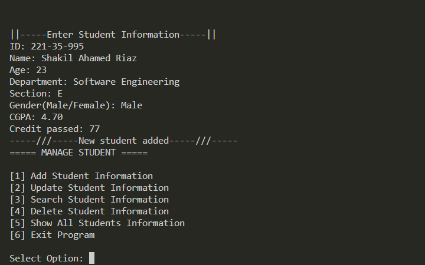
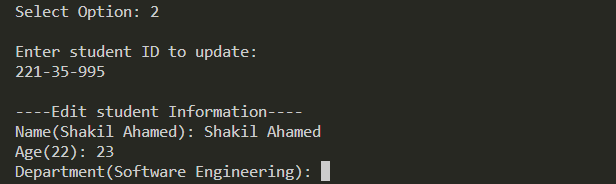
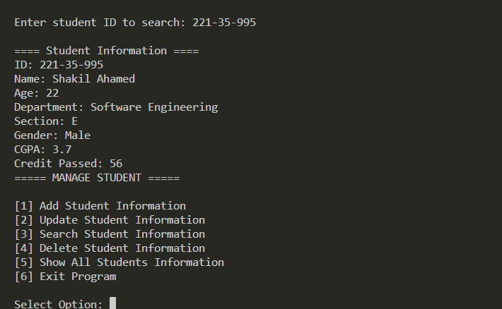
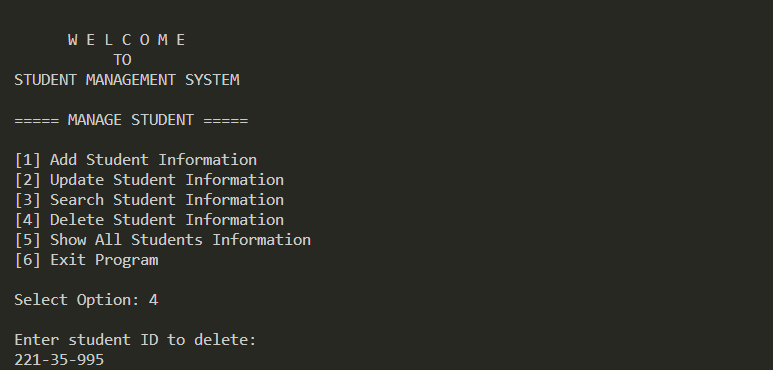
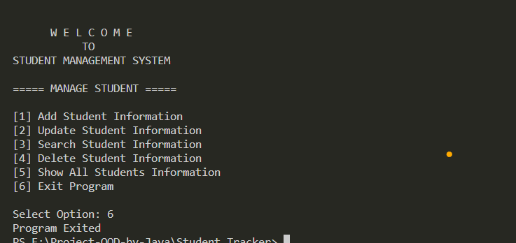

# Student Management System

The Student Management System is a comprehensive and user-friendly solution designed to streamline and enhance the management of student-related activities within an educational institution. This project aims to create a centralized platform that facilitates efficient student data management, academic record keeping, and communication between students, faculty, and administration.

## Project Objectives

1. **Add Student:** Enable administrators to effortlessly add new students to the system, streamlining the enrollment process and reducing manual data entry.
   
2. **Update Student Information:** Provide a user-friendly interface for administrators to modify and update student information, ensuring that the database reflects accurate and current details.
   
3. **Search Student Data:** Implement a robust search functionality that allows users to efficiently retrieve specific student information, enhancing accessibility and data retrieval speed.
   
4. **Delete Data of Students:** Enable authorized personnel to securely remove student records from the system, adhering to data privacy regulations and maintaining data integrity.
   
5. **Show Information:** Develop a feature-rich display module that presents comprehensive information about students, including enrollment details, attendance records, and academic performance.

## Projec

*All Features*

*information*

*information*

*information*

*information*

*information*

### Usage

1. [will be update]

## Contributing

Please read [will be update) for details on our code of conduct, and the process for submitting pull requests to us.

## License

Not yeat

## Acknowledgments

- Hat tip to anyone whose code was used
- Inspiration
- etc.
